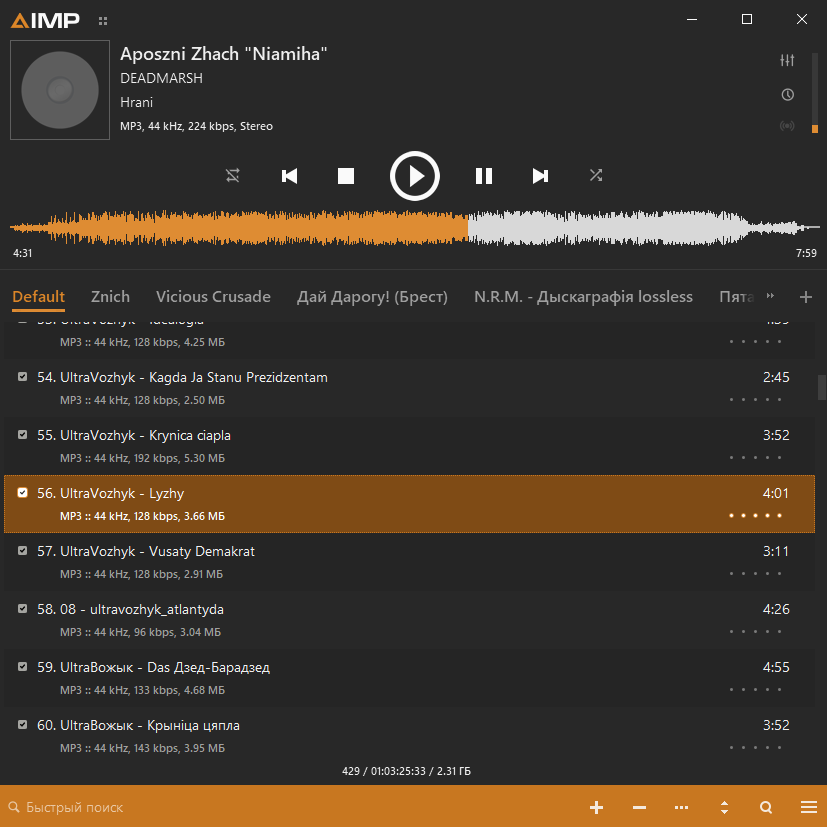

# Offline Windows Audio Player — Implementation Specification for an AI Coding Agent

**Document version:** 1.0  
**Prepared:** 2026-10-04  
**Document language:** English  
**Working product name:** Local Audio Player  
**Target:** Windows desktop, x64, fully offline at installation and runtime  
**Approved stack direction:** C# / .NET 10 LTS / WPF / BASS through ManagedBass  
**Status:** Implementation-ready specification with explicit default decisions and release gates

## Contents

- [0. Agent kickoff instructions](#0-agent-kickoff-instructions)
- [1. Product objective and interpretation](#1-product-objective-and-interpretation)
- [2. Visual reference and design rules](#2-visual-reference-and-design-rules)
- [3. Technology baseline and dependency policy](#3-technology-baseline-and-dependency-policy)
- [4. Scope and priorities](#4-scope-and-priorities)
- [5. Audio format contract](#5-audio-format-contract)
- [6. Architecture and repository layout](#6-architecture-and-repository-layout)
- [7. Threading, native ownership, and failure containment](#7-threading-native-ownership-and-failure-containment)
- [8. Playback engine and transport semantics](#8-playback-engine-and-transport-semantics)
- [9. Output devices and audio modes](#9-output-devices-and-audio-modes)
- [10. Gapless playback, crossfade, and gain](#10-gapless-playback-crossfade-and-gain)
- [11. Playlists, queue, shuffle, and history](#11-playlists-queue-shuffle-and-history)
- [12. CUE handling](#12-cue-handling)
- [13. Waveform generation, cache, and interaction](#13-waveform-generation-cache-and-interaction)
- [14. Local library indexing, metadata, and artwork](#14-local-library-indexing-metadata-and-artwork)
- [15. Storage, schema, migration, and recovery](#15-storage-schema-migration-and-recovery)
- [16. Playlist import/export and file actions](#16-playlist-importexport-and-file-actions)
- [17. Windows integration and single-instance behavior](#17-windows-integration-and-single-instance-behavior)
- [18. Keyboard, accessibility, and localization](#18-keyboard-accessibility-and-localization)
- [19. Settings UI, empty states, and error messages](#19-settings-ui-empty-states-and-error-messages)
- [20. Offline operation, privacy, and input safety](#20-offline-operation-privacy-and-input-safety)
- [21. Performance and resource budgets](#21-performance-and-resource-budgets)
- [22. Test strategy and fixture policy](#22-test-strategy-and-fixture-policy)
- [23. Acceptance scenarios](#23-acceptance-scenarios)
- [24. Packaging, reproducibility, and release content](#24-packaging-reproducibility-and-release-content)
- [25. Implementation milestones and exit gates](#25-implementation-milestones-and-exit-gates)
- [26. AI coding agent operating rules](#26-ai-coding-agent-operating-rules)
- [27. Dependency licensing and distribution gate](#27-dependency-licensing-and-distribution-gate)
- [28. Risk register and required mitigations](#28-risk-register-and-required-mitigations)
- [29. Definition of done](#29-definition-of-done)
- [30. Primary documentation and research basis](#30-primary-documentation-and-research-basis)
- [31. Ready-to-use first message for the coding agent](#31-ready-to-use-first-message-for-the-coding-agent)

## 0. Agent kickoff instructions

You are implementing a real, usable desktop music player, not a UI mockup. Read this entire specification before modifying code. Inspect the existing repository and its instructions first. Preserve existing user work.

Build the player incrementally on Windows. Use the reference screenshot for visual direction, and use this document for behavior. Implement, compile, run, inspect, and fix each milestone. Do not claim a feature works merely because its code compiles. Never claim to have heard audio, measured gapless transitions, or tested a device unless that check actually occurred.

The primary deliverable is a reproducible source repository and a self-contained Windows x64 portable distribution that works without an internet connection or a separately installed .NET runtime. An installer is optional. No server is needed.

Start by producing a short implementation plan, recording the selected SDK/package/native-library versions, and building an audio smoke test. Then follow the milestones in Section 25. Continue through authorized implementation work without repeatedly asking for approval for routine technical choices. Ask only when an unresolved product decision genuinely prevents progress; use the defaults in this specification otherwise.

Do not replace the approved stack with Electron, Tauri, a browser UI, WinUI, Avalonia, Python, or a custom C++ engine without the owner's explicit request. Do not implement codecs yourself. Do not generate a simulated waveform as a substitute for audio analysis. Do not make real UI controls silently do nothing.

If your environment is not Windows, implement and test the platform-independent parts that can be verified there, prepare the Windows build workflow, and report Windows-only checks as **not run**. Cross-compilation is not equivalent to running WPF, loading BASS, or testing WASAPI.

## 1. Product objective and interpretation

### 1.1 User-confirmed requirements

- A Windows audio player with the compact, dark, orange-accented visual character of the supplied screenshot.
- Broad support for audio files, with all normal usage completely offline.
- BASS is acceptable as the audio engine.
- The code will primarily be produced and maintained by an AI coding agent.
- Use a straightforward, maintainable implementation that supports short build-and-test cycles.

### 1.2 Default decisions introduced by this specification

These are implementation defaults, not claims that the owner individually requested every feature:

- Windows 11 x64 on a currently supported OS release is the release baseline. Record the exact Windows build used for acceptance. Windows 10 compatibility is optional and must be reported separately; do not advertise unsupported OS combinations.
- The working name is **Local Audio Player**. Keep it centralized and easy to change.
- A single main window, one application instance per user, multiple persistent playlist tabs, local library indexing, an explicit play queue, ratings, waveform seeking, and an equalizer.
- English and Russian UI resources for the first complete release. English is the development fallback.
- Shared-mode WASAPI is the default output. Exclusive mode is an advanced opt-in feature.
- No autoplay on startup. Restore the previous session in a paused or stopped state.
- Rating and playback history changes are stored in the application database; source music files remain unchanged.
- Commercial status is unresolved. Development may proceed, but public distribution requires checking the applicable BASS and dependency terms for the actual intended use.

### 1.3 Requirement vocabulary

- **MUST:** required for the applicable delivery stage.
- **SHOULD:** expected unless a documented constraint justifies an alternative.
- **MAY:** optional.
- **P0:** foundational prototype/MVP functionality. A P0 build is not the full requested release.
- **P1:** required for the complete version 1.0 defined here.
- **P2:** optional extension; do not delay P0/P1 to implement it.

The full release requires P0 and P1. A milestone demo must identify itself as a partial build. An unsupported required format or an untested core feature is an open requirement, not a completed feature.

### 1.4 Explicit non-goals

- Streaming services, internet radio, cloud sync, accounts, telemetry, remote artwork, lyrics services, online fingerprinting, remote configuration, or built-in automatic updates.
- DRM circumvention or a promise to play protected subscription-service downloads.
- Video playback, audio recording, a DAW, VST hosting, a general plugin marketplace, or a scripting runtime.
- CD ripping, transcoding/export, batch tag editing, and physical deletion of music files in version 1.0.
- ASIO, native DSD/DoP output, ARM64, and x86 as release requirements.
- Exact reproduction of AIMP branding, logos, binaries, icons, or proprietary skin files.

## 2. Visual reference and design rules

The archive includes `reference/player-reference.png`, the user-provided visual reference. It is an 827 × 827 pixel screenshot. It is a design reference, not a product asset or a statement about AIMP's internal implementation.



### 2.1 Overall appearance

- Dark graphite surfaces, light text, restrained separators, orange accent, compact spacing.
- A square-ish default window with information at the top, centered playback controls, a full-width waveform, playlist tabs, two-line track rows, and a compact bottom toolbar.
- Avoid large cards, oversized touch controls, excessive rounding, blurred acrylic surfaces, gradients, shadows, and unnecessary animations.
- Recreate the visual hierarchy and density with original controls and vector icons.
- The current track, keyboard focus, selection, hover, disabled state, and checked state must remain distinguishable.
- Selection in the screenshot is brown/orange; the played waveform is orange and its unplayed portion is pale gray.

### 2.2 Initial design tokens

Treat these as approximate design targets derived from the screenshot. Adjust slightly for readability and accessibility, and centralize every value in theme resources.

| Token | Initial value | Purpose |
| --- | --- | --- |
| Background | `#242424` | Main surface |
| Surface | `#292929` | Header, controls, alternating areas |
| AlternateRow | `#222222` | Subtle row striping |
| TextPrimary | `#ECECEC` | Track titles and primary controls |
| TextSecondary | `#B0B0B0` | Metadata and inactive tabs |
| Accent | `#E68A1F` | Progress, active tab, interactive emphasis |
| SelectedRow | `#805015` | Selected playlist entry |
| Border | `#3A3A3A` | Dividers and outlines |
| WaveformRemaining | `#D0D0D0` | Unplayed waveform |
| Error | `#F08080` | Error indicators with text explanations |
| Spacing unit | 4 DIPs | Shared layout rhythm |
| Body font | Segoe UI | Local Windows font, no downloads |
| Body size | 13–14 DIPs | Main list content |
| Metadata size | 11–12 DIPs | Secondary row |
| Title size | 18 DIPs | Current track heading |

DIPs are WPF logical units. Do not treat physical screenshot pixels as fixed layout coordinates.

### 2.3 Layout specification

| Region | Approximate size | Content and behavior |
| --- | --- | --- |
| Title bar | 32 DIPs high | Original app name/icon; menu; minimize, maximize/restore, close |
| Now playing | 104–112 DIPs high | 96 × 96 artwork on left; title, artist, album; format information; output/volume on right |
| Transport | 56 DIPs high | Shuffle, previous, stop, prominent play/pause, next, repeat |
| Waveform | 52–64 DIPs plus time labels | Full-track amplitude envelope, elapsed/total, seek interaction |
| Playlist tabs | 40–44 DIPs high | Active underline, tab overflow, add playlist |
| Playlist body | Remaining flexible height | Virtualized two-line rows, selection, enabled checkbox, duration, rating |
| Status line | 22–24 DIPs high | Item count, known total duration, size or background task status |
| Bottom toolbar | 36–40 DIPs high | Search, add, remove, more actions, sorting, queue/menu access |

- Initial window size: approximately 840 × 860 DIPs, clamped to the available work area. Minimum intended size: 640 × 520 DIPs, with sensible behavior on smaller work areas.
- Resize using layout panels, not hard-coded absolute positioning.
- Long titles use ellipsis and full-text tooltips. Mixed Cyrillic/Latin text and Unicode paths must render correctly.
- Playlist rows should be about 52–58 DIPs high in the reference mode. A compact single-line mode is P2.
- At narrow widths, hide secondary metadata before hiding transport controls or track titles.
- Use a single central play/pause button. The screenshot's separate pause icon does not require duplicating the same primary action.
- No essential operation may exist only behind an unlabeled icon or hover state.

### 2.4 Window behavior

- Use WPF `WindowChrome` or an equivalent well-contained native integration if custom chrome is implemented.
- Preserve normal resizing, dragging, system menu, maximize/restore, taskbar behavior, and Windows snap interactions that the chosen implementation can support.
- Do not implement a fragile frameless window solely to imitate the screenshot. A stable standard frame is acceptable during P0; the polished reference-style frame is P1.
- Respect per-monitor DPI and work-area changes. Restore bounds safely when a monitor has been disconnected.
- Test 100%, 150%, and 200% scaling, including moving the window between displays where available.
- Closing exits by default. “Close to tray” is an explicit setting, not an unexpected default.

## 3. Technology baseline and dependency policy

| Layer | Required choice | Constraints |
| --- | --- | --- |
| Language/runtime | C# / .NET 10 LTS | Stable language features only; nullable reference types enabled |
| UI | WPF / XAML | SDK-style Windows desktop project; no browser engine |
| Presentation pattern | CommunityToolkit.Mvvm | Standard observable properties/commands; no unnecessary framework stack |
| Audio bindings | ManagedBass | Verify APIs against the pinned package and matching native docs |
| Audio core | BASS | Native x64 DLL bundled in release |
| Mixing | BASSmix | Persistent mixer and controlled transitions |
| Windows output | BASSWASAPI | Shared default, optional exclusive mode |
| Formats | Approved BASS decoder add-ons | Exact tested set recorded in a capability manifest |
| Metadata/artwork | TagLibSharp | Background reads; source files read-only in v1.0 |
| Database | Microsoft.Data.Sqlite | Parameterized SQL and versioned migrations; no ORM required |
| Settings | System.Text.Json | Versioned schema and atomic replacement |
| Tests | xUnit | Pure logic tests plus explicitly categorized integration checks |
| Logging | Small local logging implementation or Microsoft.Extensions.Logging provider | Bounded rotating files; no network sink |
| Packaging | `dotnet publish`, self-contained `win-x64` | Native dependencies explicitly included and checked |

### 3.1 Version discipline

- Discover the latest suitable stable releases when starting implementation; pin the exact SDK in `global.json`, managed package versions, and native binary versions.
- Do not invent a package name or version. Confirm existence and compatibility using primary documentation and an actual restore/build.
- Commit a NuGet lock file and use locked restore for reproducible verification after establishing the initial dependency set.
- Never assume ManagedBass includes the native BASS runtime. It is a wrapper.
- Never substitute BASS.NET for ManagedBass accidentally; these are different distributions with potentially different API and licensing requirements.
- If a wrapper lacks a necessary native API, first determine whether a compatible wrapper update exists. A minimal documented P/Invoke addition is allowed when necessary; do not rewrite the entire binding layer.
- Record architecture, source URL, version, SHA-256, redistribution terms, and required companion files for each native binary.
- Verify deployment on a Windows machine without a developer SDK. Do not rely on native DLLs found incidentally on the developer's PATH.

### 3.2 Build environment

- Prefer a coding agent running on Windows with filesystem, shell, build, application launch, logs, and screenshot/UI inspection access.
- Visual Studio or Rider may be used by a human; the build must also work from the .NET CLI.
- Use PowerShell scripts for Windows setup/build/publish helpers. Do not require a specific IDE to build.
- Development restore may use the internet. The delivered application and first-run experience must not require it.
- Completely offline development is a separate concern: it requires pre-provisioned SDK, NuGet packages, and native binaries, and is not implied by offline runtime operation.

## 4. Scope and priorities

| Capability | Priority | Completion expectation |
| --- | --- | --- |
| Open files/folders, play/pause/stop/seek, volume | P0 | Real audio through BASS |
| Core lossy/lossless format set | P0 | Verified representative fixtures |
| Reference-style main layout | P0 | Functional controls; P1 visual polish |
| Persistent playlist tabs, reorder, multi-select | P0 | Stable identity and restart persistence |
| Search within active playlist | P0 | Unicode-aware, non-destructive filter |
| Real waveform generation, caching, seeking | P0 | Independent background decoding |
| Missing/corrupt file handling | P0 | No crash, no infinite skip loop |
| Session/settings persistence | P0 | No autoplay on startup |
| Local library index and library search | P1 | Responsive with large collections |
| Explicit queue, shuffle history, repeat modes | P1 | Deterministic documented behavior |
| Gapless for supported combinations and CUE tracks | P1 | Measured digital output evidence |
| Equalizer, ReplayGain, optional crossfade control | P1 | Clear mode interactions and clipping policy |
| Device selection and recovery | P1 | Shared and supported exclusive scenarios |
| Global media keys, tray, OS media integration | P1 | Playback state stays synchronized |
| Ratings, history, playlist import/export | P1 | Local-only writes, portable paths where appropriate |
| English/Russian resources and accessibility | P1 | Keyboard, scaling, screen-reader names |
| Additional specialist formats | P1 or P2 per Section 5 | No untested support claims |
| Spectrum visualization, light theme, mini-player | P2 | Only after P0/P1 |
| ASIO, native DSD, tag editor, installer | P2 | Separate design and tests |

## 5. Audio format contract

### 5.1 Meaning of broad format support

Do not advertise “every audio file.” Support is defined by container, codec, encoding profile, deployed decoder, and tested behavior. A file extension alone does not identify a codec. DRM, corruption, uncommon encodings, missing decoder components, and hardware output limits remain possible.

Every advertised format needs at least one legal, reproducible fixture. Important encodings need several. A decoder successfully opening a file is insufficient: test duration, playback, seeking, end-of-track behavior, and metadata separately.

### 5.2 Format matrix

The mechanisms below are implementation candidates to verify, not a claim that a base BASS DLL supports every row.

| Format/container | Stage | Intended mechanism | Required caveats/checks |
| --- | --- | --- | --- |
| MP3 | P0 | BASS | CBR/VBR; Xing/LAME metadata; seek and encoder padding |
| WAV | P0 | BASS | PCM 16/24/32-bit and float where supported; RF64 fixture for large files in P1 |
| AIFF/AIF | P0 | BASS | Common PCM encodings; do not promise every compressed AIFF variant |
| FLAC | P0 | BASSFLAC | 16/24-bit, common rates, embedded cover art |
| Ogg Vorbis | P0 | BASS | Distinguish Vorbis from other Ogg codecs |
| Opus / Ogg Opus | P0 | BASSOPUS | Pre-skip, duration, seek, end trimming |
| AAC / M4A | P0 | Approved AAC decoding path | AAC-LC and HE-AAC coverage; ADTS versus MP4; review add-on terms |
| ALAC / M4A | P0 | BASSALAC or a verified bundled path | Do not infer codec from `.m4a` |
| WMA | P1 | Verified BASS/Windows path or approved decoder | Normal and applicable lossless variants separately; Windows N/optional media components must not be silently assumed |
| APE | P1 | BASSAPE | Seek performance and large-file behavior |
| WavPack / WV | P1 | BASSWV | Lossless and hybrid behavior reported accurately; correction-file handling tested |
| Musepack / MPC | P1 | Approved MPC add-on | Version/profile coverage and licensing verified |
| TTA | P1 | Approved TTA add-on | Corrupt-file handling and seek |
| DSF / DFF | P1 | BASSDSD | PCM conversion only in v1.0; no native DSD claim |
| CUE + supported audio | P1 | Application CUE parser + existing decoder | CUE is an index/metadata document, not an audio codec |
| M4B without DRM | P1 | Verified MP4/AAC/ALAC path | Long duration; chapter UI is P2 |
| MOD / XM / IT / S3M | P2 | BASS music/module API | Separate handling from ordinary streams; loops and duration policy |
| MIDI | P2 | BASSMIDI + legally distributed local soundfont | No network soundfont download or OS synthesizer assumption |
| AC-3 / DTS / other audio codecs | P2 | Individually approved add-ons | Decode to PCM; no passthrough claim |
| SACD ISO, archives, exotic game formats | Out of v1.0 | Separate proposal | Do not silently extract archives or execute plugins |
| DRM-protected media | Excluded | None | Explain unsupported protection without attempting bypass |

### 5.3 Decoder packaging and discovery

- Load approved decoders from a controlled application directory, never the current working directory or arbitrary music folders.
- Initialize each add-on, record its load result and supported type information, and expose a diagnostic capability list.
- Prefer one reliable decoder path per format rather than several unpredictable fallback chains.
- No first-run downloads, external codec-pack instructions, or hard-coded assumption that Windows optional media components are installed.
- For system-codec-dependent formats, either bundle an appropriate redistributable decoder, explicitly constrain the supported OS configuration, or report the format as unavailable. A fully offline, broadly compatible release should prefer a bundled path.
- If a required format cannot be legally or technically shipped, record the blocker and propose a concrete alternative. Do not silently remove it from the acceptance matrix.
- An FFmpeg-based fallback is P2 and requires an explicit architecture/dependency decision. Do not add it automatically merely to hide missing BASS plugin setup.

## 6. Architecture and repository layout

Use a modular monolith with small, explicit boundaries. Start with two production projects and a test project; add a separate integration-test project only when it helps isolate Windows/native tests.

| Path | Responsibility |
| --- | --- |
| `src/Player.Core/` | Platform-neutral models, queue/order rules, playlist operations, interfaces, CUE logical model |
| `src/Player.App/Views/` | WPF windows and views |
| `src/Player.App/ViewModels/` | Presentation state and commands |
| `src/Player.App/Controls/` | Waveform and other necessary custom controls |
| `src/Player.App/Themes/` | Colors, typography, control templates, icons |
| `src/Player.App/Resources/` | Localized strings and original static assets |
| `src/Player.App/Services/Audio/` | BASS implementation, decoder loading, DSP, output |
| `src/Player.App/Services/Library/` | Indexing, metadata, artwork, filesystem observation |
| `src/Player.App/Services/Storage/` | SQLite repositories, migrations, settings |
| `src/Player.App/Services/Windows/` | Tray, media keys/session, instance IPC, file-open integration |
| `tests/Player.Core.Tests/` | Deterministic domain tests without sound hardware |
| `tests/Player.IntegrationTests/` | Optional Windows/native/data integration suite |
| `scripts/` | Reproducible build, setup, publish, validation helpers |
| `docs/` | Architecture, requirement status, format matrix, test results |
| `native/win-x64/` | Approved native files or manifest + provisioning instructions, as licensing allows |

- `Player.Core` must not reference WPF, ManagedBass, the Windows dispatcher, or SQLite.
- WPF view models consume service interfaces and domain models. They must not call native audio functions directly.
- Use constructor injection. A small composition root is sufficient; a DI container is optional.
- Avoid CQRS, event sourcing, a generic repository framework, a custom message bus, and service-per-method abstractions.
- Code-behind is acceptable for view-only behavior such as focus, drag geometry, and window chrome. Playback/queue/storage rules belong outside it.
- Use cohesive files; split very large files by responsibility, not an arbitrary line quota.

### 6.1 Main service boundaries

| Interface/concept | Owns |
| --- | --- |
| `IAudioPlayer` | Engine state, load/play/pause/stop/seek, output position and errors |
| `IPlaybackCoordinator` | Playlist/queue/history decisions and track transitions |
| `IWaveformService` | Analysis jobs, peak cache, cancellation, versioning |
| `IMetadataService` | Tags, duration hints, cover extraction, bounded read failures |
| `ILibraryService` | Roots, scans, incremental updates, library search |
| `IPlaylistRepository` | Persistent playlist/order/rating operations |
| `ISettingsStore` | Versioned preferences and safe persistence |
| `IAudioDeviceService` | Enumerated endpoints, preferred output, device events |

Names may change, but retain these responsibility boundaries. Do not force all native operations into a single unmaintainable “god service.”

### 6.2 Core models

- `MediaFile`: stable database ID, normalized local path, size, modification timestamp, container/codec facts, metadata, availability.
- `Track`: logical playable item referencing a media file and optional CUE segment bounds. Multiple tracks may share one file.
- `Playlist`: stable ID, display name, tab order, sort/view state.
- `PlaylistEntry`: unique ID, playlist ID, track ID, order key, enabled flag. Duplicates of the same track are allowed and remain separate entries.
- `QueueItem`: unique ID, track/segment snapshot, origin entry if any, queue order.
- `PlaybackSnapshot`: session generation, state, active item ID, audible position, duration, device, volume, capabilities, recoverable error.
- `AudioFormatInfo`: actual decoded sample rate, channel count/layout, known bit depth/bitrate, output format. Unknown values stay unknown.

Use explicit units and 64-bit sizes/time representations. CUE frame indices use integer 1/75-second units at parse boundaries. Never use file name, display index, or list position as permanent identity.

## 7. Threading, native ownership, and failure containment

### 7.1 Execution model

- UI dispatcher: short presentation updates only.
- Serialized engine command path: native graph changes, transition commits, handle lifecycle, seeks, and output reconfiguration.
- Native audio callback path: bounded real-time work, preallocated buffers, no UI or database access.
- Bounded background workers: metadata reads, library scans, waveform analysis, artwork decoding, database work.
- Use cancellation tokens and generation IDs so stale asynchronous results cannot replace the current track's UI or seek state.
- Do not use `async void` except actual UI event handlers. Do not block UI on `.Wait()` or `.Result`.

### 7.2 Real-time rules

- No synchronous logging, filesystem I/O, SQL, locks that can wait on UI, managed allocation spikes, or `Dispatcher.Invoke` inside audio callbacks.
- Retain strong references to all native callback delegates for their full native registration lifetime.
- Never let an exception escape into unmanaged callback code. Convert it into a safe error signal and handle it outside the callback.
- Precompute the next item and transition plan before an end/position sync. Only minimal documented real-time-safe actions may occur at the exact boundary.
- A UI event or timer cannot be the timing source for sample-accurate transitions.

### 7.3 Resource ownership

- Every BASS stream, mixer, sync, DSP attachment, plugin handle, and output context has one documented owner.
- Use deterministic disposal/handle wrappers, and prevent use-after-free through serialized ownership transitions.
- Do not blindly wrap every native handle in the same `SafeHandle`; destruction functions and callback lifetime requirements differ. Choose wrappers that match the actual API.
- Read the native error code immediately after a failed call, before subsequent calls overwrite diagnostic context.
- Shutdown sequence: stop accepting commands, cancel background jobs, quiesce output/callbacks, detach callbacks/DSP, free streams/mixers, unload plugins, release output and BASS, then close storage and UI resources. Adapt exact ordering to the documented API dependency rules.
- Cancellation must not free a stream that a callback is still using.
- In-process native decoders cannot be guaranteed crash-proof. Use approved binaries and bounded inputs; record crash isolation as a possible later enhancement, not a false guarantee.

## 8. Playback engine and transport semantics

### 8.1 Processing pipeline

Design a persistent output graph:

1. Local file decoder or segment source.
2. Per-track gain and transition envelope.
3. Mixer/resampler operating in a negotiated output format.
4. Master equalizer, preamp, and clipping-protection stage when enabled.
5. Application volume/mute.
6. WASAPI output.

Use floating-point processing where supported. Keep output alive across compatible transitions. Do not decode complete tracks into RAM. Initial P0 may use a simpler single-stream graph if the public service boundary already supports the P1 mixer path.

Document the final actual ordering of DSP and gain. Tests and UI descriptions must match it. All gain stages that can create over-range values must be accounted for by the clipping policy.

### 8.2 State machine

| State | Meaning | Expected actions |
| --- | --- | --- |
| Empty | No active item | Open/add/select available |
| Loading | Current generation opening/preparing | Cancel, stop, or replace request |
| Stopped | Item selected, position reset | Play starts at segment beginning |
| Playing | Output actively advancing | Pause, stop, seek, next, previous |
| Paused | Position retained, no intended audible output | Play resumes; seek updates retained position |
| Seeking | Current seek in progress | Latest seek supersedes earlier pending seek |
| DeviceUnavailable | Output interrupted | Show recovery controls, preserve context |
| Error | Current item could not be played | Retry, choose another item, inspect explanation |

The UI may combine transient indicators with a simpler primary transport state. Terminal errors must never leave the play button showing active playback when output has stopped.

### 8.3 Command behavior

- **Play:** resume paused item; start selected item if stopped; otherwise choose the first enabled playable entry when nothing is selected.
- **Pause:** retain item and audible position; use documented output pause behavior rather than recreating the file.
- **Stop:** silence output, cancel pending transition, retain selected track, reset to its logical beginning. Do not clear playlists or queue.
- **Next:** consume explicit queue first, then resolve playlist order; manual Next escapes repeat-one.
- **Previous:** if more than 3 seconds into the track, restart it; otherwise go to the prior actually played item. At history start, restart current track. Preserve enough forward/history state to make behavior deterministic.
- **Seek:** clamp to the valid logical track range; reject when unsupported; preserve whether playback was paused or playing. Coalesce drag requests and apply a final precise request on release.
- **Volume:** app-local 0–100% mapping with documented curve, persisted; do not change the global Windows master volume.
- **Mute:** temporary independent mute state; restore the previous app volume when unmuted.
- **End:** advance according to queue/repeat/shuffle, or stop at the end of the sequence. Do not loop indefinitely over bad entries.

When a duration is unknown, display an unknown value and disable proportional seeking until a trustworthy range is available. Never divide by zero.

### 8.4 Position and duration correctness

- The display must represent the position being heard, not the decoder's read-ahead position.
- With a mixer and WASAPI, account for mixer/output buffering using the documented latency-aware mechanism. Do not assume a decoding stream's raw position is audible position.
- CUE position is relative to the logical track start, with source offsets maintained internally.
- Timer updates at about 10 Hz are sufficient for numeric labels. A lightweight waveform cursor can interpolate between snapshots at up to 30 Hz while visible.
- Paused, stopped, or minimized windows should avoid unnecessary redraws.
- Stale position notifications from old playback generations must be ignored.
- Metadata-provided duration may be a hint; use the engine's validated playable duration when available.

### 8.5 Loading, cancellation, and rapid input

- New Load replaces the prior pending generation. A slow old decoder must not start playing after the user has chosen another item.
- Serialize native mutation operations. Stress-test repeated next/previous/seek/play/pause commands.
- If an open failure occurs during automatic advance, mark the failed candidate, try a bounded number of distinct candidates, and stop with a useful message when exhausted.
- If the user explicitly selects a bad file, report that file's failure visibly. Do not make a different song unexpectedly play without explaining the skip.

## 9. Output devices and audio modes

### 9.1 Shared mode: required default

- Enumerate output endpoints with friendly names and stable endpoint IDs where available.
- Support “Windows default output” and explicitly selected output.
- Negotiate the actual endpoint mix format; resample sources as needed.
- Show source sample rate/channel count separately from output sample rate/channel count.
- Do not display “bit-perfect” in shared mode or whenever resampling, EQ, normalization, crossfade, volume processing, or channel conversion is active.
- Default stereo listening must behave sensibly. Multichannel files may be downmixed according to a documented mapping; do not promise arbitrary speaker routing.

### 9.2 Exclusive mode: P1 advanced option

- User enables it explicitly and sees a brief explanation that other applications may be unable to use the device concurrently.
- Negotiate supported sample rate/channel/sample-format combinations before playback.
- If the requested mode is unavailable, show a clear error. Shared-mode fallback is offered or controlled by an explicit setting; never hide the change.
- Sample-rate switching may interrupt output. Gapless across incompatible exclusive device formats is not guaranteed and must be documented.
- Device format and processing information must remain truthful. A true bit-perfect mode is P2, not a label to attach to exclusive mode automatically.

### 9.3 Recovery policy

- Default-device mode follows Windows default changes using a controlled reinitialization.
- If an explicitly selected device disappears, pause and show “Output device unavailable.” Offer selection or an opt-in fallback-to-default setting.
- Preserve active item and last reliable position. Do not surprise the user by switching from headphones to speakers at high volume.
- Sleep/resume recovery should return paused unless uninterrupted resumption is explicitly enabled and validated.
- Handle busy exclusive device, unplugged USB DAC, removed Bluetooth endpoint, and zero available output devices.
- Bluetooth/device latency is not an application precision guarantee; separate internal timing from acoustic measurements.

## 10. Gapless playback, crossfade, and gain

### 10.1 Gapless requirements

- P1 must support gapless transitions for a documented set of local-file combinations, starting with contiguous CUE segments and matching-rate lossless tracks.
- Prefetch/open the next decoder and sufficient initial data before the current source runs out. Do not preload every track.
- Honor codec delay/padding metadata when available; do not remove genuine intentional silence embedded in the recording.
- Keep a stable mixer/output format in shared mode; resample when needed rather than resetting the device per song.
- Queue changes, shuffle toggles, file removal, and seek near track end must invalidate/recompute the prepared next source safely.
- Use a fixture created by splitting a known continuous signal into adjacent lossless tracks. Capture the digital output path, account for stable system latency, and check for added gaps, duplicated content, and boundary discontinuities.
- A UI timer switching tracks, absence of an exception, or the existence of a BASS sync callback is not proof of gapless playback.
- Lossy gapless claims require separate MP3/AAC/Opus fixtures and verified delay/padding behavior. Report unsupported combinations rather than claiming universal seamlessness.

### 10.2 Crossfade requirements

- Crossfade is a P1 feature, disabled by default, with a configurable 0–10 second duration; initial default when enabled is 3 seconds.
- Equal-power envelopes are a reasonable default, with overload prevention. Document the curve.
- It applies to automatic transitions. Manual Next uses a short anti-click transition or immediate controlled replacement, not the full configured crossfade.
- Disable crossfade for contiguous CUE segments and repeat-one by default to preserve album continuity and deterministic repeats.
- For very short tracks, clamp overlap to a sensible fraction of available duration; no negative ranges or overlapping multiple generations accidentally.
- Transition UI switches the active item at the defined start of the incoming item. Position then refers to that item. History may retain both overlap participants internally.
- Seeking during a crossfade cancels the overlap and seeks the current incoming item. Stop silences both sources. Pause pauses the complete output graph.
- Crossfade and gapless are different modes. Do not describe an intentional overlap as sample-contiguous playback.

### 10.3 ReplayGain and equalizer

- ReplayGain modes: Off, Track, Album. Default Off. Missing gain tags mean 0 dB adjustment; optional fallback gain is an advanced setting.
- Parse known gain/peak tags with invariant numeric handling. Invalid/extreme values are ignored with bounded diagnostics.
- Album mode uses available album gain consistently. Do not pretend to have calculated gain when only reading tags.
- No background full-library loudness analysis in v1.0.
- Provide a 10-band EQ with approximate centers at 31, 62, 125, 250, 500, 1k, 2k, 4k, 8k, and 16k Hz, a preamp, flat reset, bypass, and local presets.
- Band range: approximately ±12 dB. Smooth parameter changes to avoid clicks.
- Use verified BASS DSP/effect APIs. Bands at/above the current Nyquist limit must be constrained or disabled safely.
- Clipping prevention: use headroom based on available peak/gain information and a documented final protection strategy when processing can exceed full scale. If a limiter is used, disclose it in output diagnostics and test it.
- Never silently normalize every file, boost volume, or write gain values back into music files.

## 11. Playlists, queue, shuffle, and history

### 11.1 Playlist tabs and editing

- At least one persistent playlist exists on first launch: “Default.”
- Create, rename, reorder, duplicate, and delete playlist tabs. Deleting the final tab creates an empty Default tab.
- Tab overflow uses horizontal scrolling or an overflow menu. Tabs must not shrink to unreadable labels.
- Add files, folders recursively, or supported playlist documents through dialogs and drag-and-drop.
- Dropping onto a playlist appends items without interrupting playback. “Open and play” is a separate explicit action.
- Multi-select supports Ctrl/Shift, Select All, keyboard navigation, context menu actions, and removal from playlist.
- Removing an entry never deletes the source file. Make the menu wording explicit: “Remove from playlist.”
- Duplicate entries are valid. “Remove duplicates” is a separate command with an explicit identity policy and preview/count.
- Reorder entries by drag-and-drop and keyboard commands. Persist order transactionally.
- Sorting is stable and supports title, artist, album, track/disc number, duration, path, and date added. Unknown values have deterministic placement.
- Disallow ambiguous manual reorder while a non-manual sort or search filter is active, or expose an explicit “Return to manual order” action. Never silently reorder hidden entries unpredictably.
- Playlist playback order is the full persisted order, not the current search result subset. A separate “Play filtered results” action may create an explicit temporary queue.
- Editing one playlist must not replace the source sequence of playback started from another playlist.

### 11.2 Row behavior

Each row contains an enabled checkbox, optional sequence number/current-playing marker, primary text, secondary metadata, duration, and 0–5 rating. The checkbox controls eligibility for automatic playlist traversal; it does not select the row and does not delete anything.

- Single click selects; double click plays.
- Space uses the transport shortcut unless a checkbox or other interactive control has keyboard focus, in which case native control behavior takes precedence.
- Selected, playing, and disabled are independent states. A playing track can be visible while another row is selected.
- A disabled entry is skipped during automatic traversal. Explicitly double-clicking it is allowed and does not permanently re-enable it; after it ends, traversal resumes with enabled entries.
- Ratings are integer 0–5, where 0 means unrated. Store by logical track, so duplicates share the same rating. CUE tracks can have independent ratings.
- Metadata fallback: display filename without extension when title is missing. Use truthful “Unknown artist/album” resources or omit empty fields consistently.
- Duration text supports tracks longer than one hour. Do not format a long audiobook as minutes modulo 60.

### 11.3 Explicit queue

- “Play next” inserts immediately after the current item, preserving the selected batch order.
- “Add to queue” appends to the explicit queue.
- Display queued items in a dedicated panel or window with reorder, remove, and clear actions.
- Explicit queue items are consumed before normal playlist traversal. Consuming them does not change the playlist cursor used for resumption.
- Manual Next consumes queue items. Previous uses playback history, not reverse queue consumption.
- Removing a playlist entry does not silently delete an already queued snapshot; mark it as detached if its origin no longer exists.
- Clearing the queue does not stop the current song.
- Deleting the source playlist does not crash or interrupt current playback; finish the current item and queued snapshots, then stop unless another source is selected.

### 11.4 Repeat and shuffle interaction table

| Situation | Required behavior |
| --- | --- |
| Repeat Off, no queue, sequential | Advance once through enabled entries, then stop |
| Repeat All, no queue, sequential | Wrap to first enabled entry after last |
| Repeat One, natural end, no queue | Restart the same logical track |
| Repeat One with an explicit queued item | Explicit queue takes precedence at natural end; repeat applies to the newly active item afterward |
| Manual Next with Repeat One | Advance normally; never trap the user on one track |
| Shuffle | Use a randomized bag of eligible stable entry IDs; avoid repeats within a cycle |
| Repeat All + Shuffle | Refill after exhaustion; avoid immediate same-item repeat when more than one eligible item exists |
| Shuffle + Previous | Return through actual playback history |
| Toggle shuffle during playback | Keep the current item; rebuild remaining candidates predictably |
| All entries disabled/missing | Stop with useful state; never busy-loop |
| Track removed while playing | Current playback may finish; advance using remaining valid source entries |

Inject a random source in domain tests. Persist enough shuffle/history state for coherent restoration, or document that a new shuffle cycle begins after restart. Choose the former when practical; never claim exact restoration if only the current track is stored.

### 11.5 Playback history

- Record playback starts for Previous navigation separately from long-term listening statistics.
- Count a “play” after at least 50% of a track or 240 seconds, whichever is earlier, with a 5-second minimum for ordinary tracks. Tracks shorter than 5 seconds count on natural completion.
- Seeking forward is not listened time. Paused/device-unavailable time does not count.
- Increment once per playback occurrence, not on every resume event. Repeat-one cycles are distinct occurrences after completion.
- Save bounded recent history and expose a clear-history action. No cloud synchronization.

## 12. CUE handling

### 12.1 Supported document model

- Support common `FILE`, `TRACK AUDIO`, `TITLE`, `PERFORMER`, `INDEX 00`, `INDEX 01`, and relevant `REM` metadata in single-file and multi-file CUE sheets.
- Use a real tokenizer/parser that handles quoted file names, whitespace, Unicode, and malformed lines. Do not rely on one fragile regular expression.
- Try BOM-aware Unicode/UTF-8 first. For invalid UTF-8 legacy files, provide a selectable fallback encoding, including a Cyrillic-compatible option. Do not silently replace bytes with corrupt text and save them.
- Resolve referenced audio paths relative to the CUE file. Absolute local paths may be accepted deliberately; URLs and network paths follow the offline policy in Section 20.
- Report missing referenced files per document/track while retaining the rest of the valid import.
- Validate index order and source duration; reject negative, decreasing, or impossible ranges.

### 12.2 Segment semantics

- Logical track start is `INDEX 01` for that track.
- Logical track end is the next applicable `INDEX 01` within the same source file, or source EOF for the last track in that file.
- Under this default policy, an inter-track `INDEX 00` pregap remains part of the preceding segment up to the next `INDEX 01`. Document this behavior.
- Audio before the first `INDEX 01` is not silently inserted into the first track; hidden-track/pregap exposure is P2.
- For multi-file CUE sheets, do not use an index from the next source file as a byte/time offset in the previous file.
- Prefer a shared decode timeline for contiguous segments of the same file when it improves boundary correctness.
- Translate CUE frames to source timing carefully; when a boundary does not align exactly with an output sample, apply one consistent rounding policy and avoid cumulative drift.
- Segment seek, repeat-one, waveform clipping, displayed duration, and Previous restart operate on logical segment bounds.
- Keep a `Track` identity distinct from its `MediaFile`; otherwise different CUE songs will incorrectly share play position/history.

## 13. Waveform generation, cache, and interaction

### 13.1 Analysis algorithm

- Decode locally to PCM through an independent decode-only stream. Never consume samples from the active playback source to build the full-track waveform.
- Analyze in bounded chunks. Compute min/max amplitude per time bucket; retain positive and negative peaks, and optionally RMS for future display modes.
- For stereo/multichannel overview, use a documented channel aggregation that preserves peaks, such as per-bucket extrema across channels. Do not sum channels in a way that cancels opposite-phase audio.
- Use a multiresolution or sufficiently fine bounded peak representation; target roughly 100 buckets per second at the finest useful overview level, with coarser levels for long files.
- Avoid an allocation proportional to the full uncompressed track length. A multi-hour file must not produce a multi-gigabyte PCM buffer.
- Compute the base waveform without playback EQ, volume, crossfade, or ReplayGain so it remains stable when settings change.
- For CUE, reuse the source file's cached peaks and display only the segment range with correct relative coordinates.

### 13.2 Worker policy

- Analyze the active file first. Use one background analysis worker initially; raise concurrency only with measured benefit.
- Playback and user interactions have priority over scanning and waveform jobs.
- Deduplicate simultaneous requests for the same cache key.
- Cancellation must release the analysis decoder and file handles safely. Partial results may be shown progressively but cannot be marked complete.
- When the active track changes, old analysis may finish into cache but must not overwrite the new track's display.
- Do not compute waveforms for the entire library automatically. Analyze on demand and optionally precompute only a small next-item window.
- Provide a simple progress/loading state and a seekable duration timeline when waveform analysis is not yet available.

### 13.3 Cache design

- Key includes canonical source identity, file size, modification timestamp, analysis algorithm version, and relevant decoder/format version when its behavior matters.
- Path/size/time is a practical default, not a cryptographic identity guarantee. Provide a cache-refresh command; optional content hashes must not force a full-file read on every startup.
- Store an explicit binary header: magic, schema version, source fingerprint, channel aggregation, bucket timing/count, data lengths, completion/checksum information.
- Validate lengths and counts before allocating memory. Reject corrupt or oversized cache entries and regenerate safely.
- Write to a temporary file, then atomically replace the cache entry on successful completion.
- Cache is disposable; SQLite playlists/ratings are not. “Clear cache” must never delete the music library database.
- Default waveform cache budget: approximately 512 MiB, configurable; apply LRU-style eviction outside the real-time/UI paths.
- Cache folders are local app data or the portable data directory, never adjacent to source music files by default.

### 13.4 Rendering and seeking

- Use a custom lightweight WPF drawing control (`DrawingContext`, cached geometry, or equivalent).
- Do not create one WPF element per sample or peak bucket.
- Draw the waveform geometry once per relevant data/size/theme change; update the played portion through clipping/overlay instead of rebuilding all geometry every frame.
- Played portion uses accent orange; remaining portion uses gray; background is transparent over the dark surface.
- Hover tooltip shows proposed seek time. Click seeks. Drag shows a preview and commits/coalesces seeks according to engine policy.
- Clamp pointer mapping to `[0, duration]`; handle zero width, unknown duration, and pointer capture loss.
- Keyboard interaction and an accessible seek slider representation must be available. A purely decorative drawing is insufficient.
- The waveform is the amplitude envelope of the complete recording, not a live FFT spectrum.

## 14. Local library indexing, metadata, and artwork

### 14.1 Library model and indexing

- A library is an index of user-selected local folders; music remains in its original location.
- Adding a root asks for a local directory and starts a cancellable background scan.
- Do not scan all drives, home folders, or network locations automatically.
- Enumerate incrementally and tolerate inaccessible folders, missing files, and individual parser failures.
- Avoid recursive junction/symlink loops. Default to not following directory reparse points unless explicitly enabled; track visited identities if enabled.
- Filter likely candidates cheaply, then probe actual decoder/metadata capabilities when needed.
- Re-scan only changed files based on path/size/time and explicit refresh policy. Preserve user ratings and playlist entries across ordinary metadata updates.
- Use bounded producer/consumer queues and batched database writes. Do not launch one task per file for a 100,000-file library.
- Initial metadata worker count should be conservative, for example 2, and reduce contention while playing from slower storage.
- Show scan counts, current progress, cancellation, and a bounded error summary. UI remains interactive.
- A `FileSystemWatcher` is a hint, not an authoritative database. Debounce bursts and reconcile after overflow/missed events with a rescan.
- Do not hash every audio file during routine indexing. Optional duplicate detection can be added later.

### 14.2 Metadata rules

- Read title, artist, album, album artist, track/disc numbers, genre, date/year, duration hint, codec/container, bitrate when meaningful, sample rate, channels, and embedded artwork.
- Distinguish absent metadata from numeric zero. VBR bitrate is identified as approximate where appropriate.
- Use TagLibSharp in a bounded background worker and dispose each opened file promptly.
- Metadata failure does not automatically mean audio decoding failure. Allow playback with filename fallback.
- Do not keep music files locked after metadata extraction. Test renaming/moving a non-playing indexed file externally.
- The database is the source for ratings, UI statistics, and local history. Do not change tags in v1.0.
- Keep display values separate from normalized search values. Preserve original Unicode spelling/case.

### 14.3 Artwork

- Order: embedded front-cover image, approved local sibling image such as `cover.jpg`/`folder.jpg`, then an original generic placeholder.
- Never fetch an image from a URL embedded in a tag.
- Enforce compressed-byte and decoded-pixel limits before accepting large artwork where possible. Initial limits: about 20 MiB encoded and 40 megapixels decoded; tune with fixtures and document exceptions.
- Decode display thumbnails at the necessary size, not full resolution on every row.
- Freeze WPF image resources where appropriate before crossing thread boundaries.
- Cache thumbnails with a bounded memory/disk budget and invalidate when the source changes.
- Corrupt images produce a placeholder and a diagnostic entry, not a broken playback session.

### 14.4 Search

- Bottom search filters the active playlist with a roughly 150–250 ms debounce.
- Search fields: title, artist, album, filename, and optional path toggle.
- Library search is a separate mode/view and queries the database without materializing every track into WPF controls.
- Support case-insensitive Latin and Cyrillic search. Do not rely on SQLite's default ASCII-focused `NOCASE` behavior as a complete Unicode search solution.
- Use normalized search columns or a verified FTS/tokenization design. Keep behavior consistent and test mixed scripts, accents, punctuation, and Unicode normalization.
- Search is literal by default, not a regex or raw SQL expression. Escape SQL wildcard characters when implementing substring search.
- Clearing search restores the same playlist order and playing item. It does not alter playback order or remove entries.

## 15. Storage, schema, migration, and recovery

### 15.1 Storage locations

- Installed/default mode: writable data under `%LOCALAPPDATA%/<Vendor>/<Product>/`.
- Portable mode: an explicit marker/configuration enables a `Data/` directory beside the executable.
- If the portable directory is not writable, show a clear choice to use per-user storage or exit; do not silently lose changes.
- Keep data, cache, logs, and native binaries in distinct directories.
- Never write the database to a remote share. Source media can be treated separately if network support is ever added.
- Persist paths in a way that supports a moved portable folder for files stored beneath its designated media root; otherwise use absolute local paths and a relink action.

### 15.2 Suggested relational schema

Exact names may change, but preserve the entities and invariants below.

| Table | Important fields and invariants |
| --- | --- |
| `MediaFiles` | ID, normalized unique path identity, display path, size bytes, modified UTC, format facts, availability, scan generation |
| `Tracks` | ID, media file ID, optional CUE document/track number/start/end, metadata, rating 0–5, play count, last played UTC |
| `Playlists` | ID, name, tab order, created/updated UTC, view/sort settings |
| `PlaylistEntries` | ID, playlist ID, track ID, order value, enabled; duplicates allowed |
| `QueueItems` | ID, track ID/snapshot, optional source entry, order value |
| `LibraryRoots` | ID, path, enabled, last scan UTC, scan policy |
| `PlaybackHistory` | ID, logical track, occurrence time, listened duration, completion/count flag |
| `SchemaMigrations` | Applied version and timestamp, or an equivalent `user_version` strategy |

- Use foreign keys intentionally and enable enforcement for every connection.
- Avoid cascade rules that destroy user playlists when a media file temporarily disappears.
- Index lookup/search/order columns based on actual queries. Do not add speculative indexes to every field.
- Reordering and multi-entry edits are transactions. Persist unique entry identity through moves.
- Use UTC for stored event times and convert for display.
- Represent duration and file sizes with integer units, not formatted strings.

### 15.3 SQLite execution policy

- All SQL uses parameters. User text and file paths must never be concatenated into executable SQL.
- Use a dedicated serialized write queue and scoped read operations; do not share one connection concurrently without a documented supported model.
- Microsoft.Data.Sqlite async-shaped APIs do not provide true asynchronous SQLite I/O. Move bounded database work off the UI thread explicitly rather than assuming `Execute...Async` prevents UI blocking.
- Enable WAL on supported local storage, configure a bounded busy timeout, keep transactions short, and batch scan writes.
- WAL does not remove the need for correct locking, connection ownership, or recovery.
- Do not copy only the main `.db` file while live WAL writes are active and call it a valid backup. Use a supported backup API or an orderly checkpoint/close workflow.

### 15.4 Migrations and corruption recovery

- Schema migrations are versioned, ordered, transactional where supported, and tested from the previous release schema.
- Before a destructive migration, create a valid local backup.
- Unknown newer schema versions cause a clear compatibility error; never silently downgrade or recreate the database.
- On detected corruption, preserve the original and offer restore/rebuild. Rebuilding the media index must not be falsely presented as recovering lost ratings/playlists.
- Distinguish an empty database from an unreadable database. Do not overwrite unreadable user data with defaults.
- Expose export/backup of user playlists/settings as a simple local operation.

### 15.5 Settings and session

- Versioned JSON settings include theme/accent, language, volume/mute, selected output mode/device, EQ presets, ReplayGain, crossfade, tray behavior, last directories, cache budget, window bounds, and restore preferences.
- Validate ranges and enum values on load. Unknown properties may be preserved or ignored deliberately; unknown schema versions must be handled explicitly.
- Use temporary-file write + atomic replace, with a previous known-good backup where practical.
- Debounce settings writes; do not write to disk for every slider pixel movement.
- Save playback session position periodically, approximately every 10 seconds, and on pause/stop/clean exit. Persist the logical track/entry identity and source sequence, not just a filename.
- Restore volume, tabs, queue, active item, and position without autoplay. If the file is missing, restore the UI and show an actionable state.
- After a crash, a slightly stale position is acceptable; corrupted playlists are not.

## 16. Playlist import/export and file actions

### 16.1 Required formats

- Import/export M3U8 using UTF-8.
- Import common M3U with BOM/encoding detection and user-selectable fallback when necessary.
- Import PLS in P1. Export PLS is optional.
- CUE import follows Section 12 and is not treated as a normal playlist text file.

### 16.2 Import behavior

- Resolve relative paths against the playlist file directory.
- Reject or mark HTTP/HTTPS/FTP/other network entries as unsupported offline sources. Never open them automatically.
- Handle missing entries as visible unavailable items or summarize them with a retained import report.
- Bound document size, entry count, and nesting. Detect recursive playlist references; default to no recursive expansion unless explicitly requested.
- Do not execute commands, shell expressions, or arbitrary URI schemes from playlist contents.
- M3U textual duration/title hints do not override validated file facts permanently.
- Preserve order and duplicate entries.

### 16.3 Export behavior

- Use relative paths when safe and useful for the chosen destination; otherwise write absolute local paths.
- Explain that ordinary M3U8 cannot reliably preserve application-specific CUE segment semantics. Either export a documented supported representation or refuse a lossy segment export with a clear explanation; do not silently replace each CUE track with the full album audio file.
- Confirm overwriting an existing user-selected file through normal save-dialog behavior.
- Do not modify exported audio files or copy the music collection as a side effect.

### 16.4 File actions

- “Show in folder” opens Explorer with a properly escaped local path and a known Windows API/process invocation; do not construct shell command strings from tags.
- “Copy path” copies plain text.
- “Properties” shows metadata, source path, decoder, and output-independent technical facts.
- “Relink missing file” updates source identity deliberately and preserves logical track/playlist metadata after validation.
- Physical delete, rename, move, and tag rewriting are P2 and must not appear as half-implemented destructive commands.

## 17. Windows integration and single-instance behavior

### 17.1 Single instance

- Use a per-user mutex or equivalent plus local IPC to forward file-open requests to the existing instance.
- Named pipes are a reasonable choice; restrict access to the current user, bound request size, validate paths, and reject arbitrary commands.
- A second launch with no arguments activates the existing window. A second launch with file arguments appends to the active playlist and activates the window by default.
- An explicit `--play` option can request immediate playback. Document the small supported command-line surface and reject unknown options clearly.
- Handle startup races and stale IPC endpoints. Do not terminate unrelated processes by name.

### 17.2 Media controls

- Support multimedia Play/Pause, Next, Previous, and Stop when available.
- Integrate with the Windows media transport/session mechanism appropriate for a desktop WPF application; verify the actual API/package requirements.
- Publish title/artist/artwork and playback state from the same coordinator snapshot used by the app.
- Do not register multiple handlers that cause one media key to skip two tracks.
- Release registrations on shutdown. Avoid taking keyboard control when not appropriate.
- Global custom keyboard shortcuts are P2; standard media integration is P1.

### 17.3 Tray and file associations

- Tray menu: Show/Hide, Play/Pause, Next, Previous, Exit. Tooltip uses bounded text.
- Hiding the window must not stop playback. Exit must dispose the engine and persist state.
- An explicit close-to-tray setting may change close behavior; make first use discoverable without repetitive prompts.
- File association support may register application capabilities per user where permitted. Never seize defaults or write unsupported Windows default-association overrides.
- Portable mode should avoid registry changes unless the user explicitly invokes association setup.
- No startup task, scheduled task, service, or administrator requirement in the default installation.

## 18. Keyboard, accessibility, and localization

### 18.1 Default shortcuts

| Shortcut | Action | Context |
| --- | --- | --- |
| Space | Play/Pause | When focus is not in a text editor or control that owns Space |
| Enter | Play selected entry | Playlist focus |
| Ctrl+O | Add audio files | Main window |
| Ctrl+Shift+O | Add folder | Main window |
| Ctrl+F | Focus active playlist search | Main window |
| Esc | Clear search/close transient UI | Do not unexpectedly stop playback |
| Delete | Remove selected playlist entries | Playlist focus only |
| Ctrl+A | Select all visible entries | Playlist focus; native text selection inside text fields |
| Alt+Left / Alt+Right | Previous / Next | Main window |
| Ctrl+Left / Ctrl+Right | Seek −5 / +5 seconds | Outside text-edit controls |
| Ctrl+Up / Ctrl+Down | App volume ±5 percentage points | Outside controls that own these keys |
| Ctrl+N | New playlist | Main window |
| F2 | Rename playlist | Playlist tab focus |
| F1 | Local help/about | No browser/network requirement |

- Make shortcuts discoverable through menus/tooltips and local help.
- Preserve standard text editing/navigation behavior. Do not intercept keystrokes globally merely because the app window is open.
- Keyboard reorder may use an additional documented combination after conflict checks.

### 18.2 Accessibility

- Logical tab order, visible focus, accessible names, state announcements for play/pause and errors, and usable context menus.
- Standard automation peers for buttons, lists, sliders, tabs, and custom seek controls where applicable.
- Do not communicate selection/current playback/errors exclusively by color.
- Aim for readable contrast, including small secondary text. Adjust approximate reference colors if needed.
- Honor high-contrast settings with a usable fallback; reference fidelity must not override legibility.
- Avoid essential hover-only interactions and rapid flashing.
- Test keyboard-only use and at least one Windows screen-reader workflow when a suitable environment is available; report unavailable manual checks honestly.

### 18.3 Localization

- All user-facing strings are resource-based, including errors and plural/count text.
- Provide English and Russian resources in P1; code identifiers/comments remain English.
- Allow language selection; restart may be required if explicitly stated. Do not ship mixed-language strings after a switch.
- Use culture-aware display for dates/numbers and invariant parsing for serialized formats/native metadata syntax.
- Unicode paths, Cyrillic file names, combining marks, and non-BMP characters must not be truncated by byte-oriented assumptions.

## 19. Settings UI, empty states, and error messages

### 19.1 Settings groups

| Group | Settings |
| --- | --- |
| Playback | Repeat/shuffle defaults, session restoration, crossfade, ReplayGain |
| Audio output | Default/specific device, shared/exclusive mode, permitted fallback policy |
| Sound | EQ, preamp, presets, clipping-protection explanation |
| Library | Roots, rescan/remove-root, metadata refresh, indexing progress |
| Appearance | Language, accent, optional font scaling, waveform display |
| Behavior | Tray, close behavior, file-open behavior, optional associations |
| Storage | Data location display, cache size/clear, backup/export, log location |
| About/diagnostics | App/version, decoder capabilities, dependency notices, copy local diagnostics |

Device/output changes apply through the engine coordinator with a clear transition; they must not mutate native state directly from a slider event. Destructive reset operations are explicit and scoped.

### 19.2 Required UI states

- First-run empty library/playlist with “Add files” and “Add folder.”
- Empty search results with a clear-search action.
- Loading track and preparing waveform without blocking transport cancellation.
- Missing file, unsupported codec, corrupt file, unreadable folder, missing decoder, output unavailable, database busy/corrupt, read-only data directory, and full disk.
- Partial scan/import success with a concise error count and expandable details.
- Unknown artwork/artist/duration handled without layout collapse.
- No audio device present at startup: the user can still browse/manage playlists.

### 19.3 Error structure

Create an internal typed error model: category, user-facing resource key, operation, affected item ID, optional native code, recoverability, and diagnostic detail. Keep user text short and actionable. Example:

> This file could not be opened. It may be damaged or use an unsupported encoding. Try another file or open technical details.

Technical details can show the actual decoder and BASS error code. Do not assert corruption when the cause is only an unknown decoder failure. Do not expose stack traces as the primary message.

## 20. Offline operation, privacy, and input safety

### 20.1 Runtime network contract

- The shipped app makes no intentional network requests during installation, first launch, browsing, playback, indexing, artwork loading, help, or normal diagnostics.
- No telemetry, crash upload, analytics SDK, remote fonts, web views, auto-updaters, online license activation initiated by the app, or download-on-demand codecs.
- Use only local filesystem input in v1.0. Reject URL sources and UNC/network paths by default. A mapped drive may be remote; detect/report it rather than implying guaranteed local operation.
- A cloud placeholder that needs hydration is not an available offline file. Detect/report unavailable content; do not promise it will open offline.
- BASS may support network sources, but this app must not expose/pass arbitrary URLs to those APIs.
- Development tools and Windows itself may perform independent network activity; acceptance distinguishes application-origin traffic from unrelated system services.

### 20.2 Input handling

- Treat tags, artwork, filenames, playlist documents, CUE sheets, IPC messages, and cache files as untrusted data.
- Use parameterized SQL, safe local process argument APIs, bounded allocations, and length/range checks.
- Never evaluate metadata as XAML, HTML, script, shell commands, or executable templates.
- Never load a DLL from a song folder or a path specified by imported media.
- Do not add broad anti-virus exclusions or require administrator privileges.
- Use user-controlled file dialogs for external writes. Library scanning never changes source audio files.
- Error handling must be bounded: no infinite retries, recursive import loops, or unbounded log growth.

### 20.3 Diagnostics privacy

- Logs stay local. Default logs may include the affected local path when needed for troubleshooting, but never file contents or full metadata dumps indiscriminately.
- “Copy diagnostics” should redact personal path prefixes by default and let the user inspect the output before sharing it.
- Retain approximately five rotating 2 MiB log files initially; make retention bounded and configurable in code.
- Do not log every audio callback, every waveform bucket, or every position update.
- Capture app/package/native versions, selected device/mode, relevant capability failures, and operation context.

## 21. Performance and resource budgets

These are initial engineering targets, not claims already measured. Record actual hardware, Windows build, storage, audio device, Release build, dataset, and measurement method. If a target is missed, profile and report the cause. Do not conceal misses by changing the test environment or silently weakening requirements.

### 21.1 Reference environment

- A normal modern x64 Windows 11 PC with at least 4 logical CPU cores, 8 GiB RAM, and an SSD.
- Ordinary local stereo music, mostly 44.1/48 kHz; include 96/192 kHz and multichannel files in compatibility tests separately.
- Performance datasets: 10,000-entry playlist, 100,000 indexed-track library, mixed metadata quality, and at least one multi-hour source.
- Record cold versus warm filesystem/metadata/waveform cache measurements separately.

### 21.2 Targets

| Metric | Initial target | Measurement notes |
| --- | --- | --- |
| Warm launch to interactive window | ≤2 seconds | Existing database; no blocking rescan |
| Cold launch to interactive window | ≤5 seconds | Report hardware/storage and distribution mode |
| Cached common track to playback | ≤1 second p95 | Local SSD, shared output; exclude failed files |
| Search response | ≤250 ms after debounce on reference dataset | Measure query + UI update, not debounce alone |
| Playlist scroll | Responsive near display refresh; no sustained stalls >100 ms | Verify actual virtualization |
| Steady playback CPU | Ideally <3% total reference CPU, waveform/scans idle | Report logical-core accounting and codec |
| Idle CPU while paused/minimized | Near zero, target <1% | No unnecessary animation or polling loops |
| Warm steady working set | Target <250 MiB for typical use | Explain artwork/native/runtime contributions |
| Large library session | Target <450 MiB with 100k indexed items | Paging/caching rather than loading all metadata/artwork |
| App-level handle/memory stability | No sustained growth during 1,000-track-change stress | Allow bounded cache growth, then stable plateau |
| Cancel background work | Acknowledged promptly, target ≤1 second | Native blocking calls may require a documented limit |
| Seek display accuracy | Within about 100 ms of validated audible timeline | Hardware latency measured/compensated separately |

Do not continuously poll devices or storage to meet UI refresh needs. Avoid per-row timers. UI virtualization and data paging are separate concerns: enabling `VirtualizingStackPanel` alone does not prevent loading a huge collection into memory.

## 22. Test strategy and fixture policy

### 22.1 Evidence levels

Every verification result must be labeled with one of:

- **Unit tested:** deterministic logic test ran and passed.
- **Integration tested:** real file/database/native API interaction ran and passed.
- **Manually verified:** a named workflow was exercised on the recorded environment.
- **Measured:** timing/audio/resource result includes its method and artifact.
- **Not run:** environment or asset unavailable.
- **Failed/blocked:** concrete reproducible issue remains.

Mocks of `IAudioPlayer` validate coordination logic only. They do not validate BASS decoding, output, gapless, or audio quality.

### 22.2 Test fixture rules

- Use generated audio, public-domain/appropriately licensed fixtures, or owner-provided files with permission. Do not download copyrighted commercial music as test data.
- A fixture manifest records path, expected codec/container, sample rate, channels, duration tolerance, checksum, provenance/license, and intended checks.
- Tiny generated WAV/FLAC signals are appropriate for boundaries, channel mapping, seeking, and gain measurements.
- Include representative lossy fixtures with meaningful encoder delay/padding metadata.
- Generating fixtures with FFmpeg during development is allowed if provisioned and documented; it must not become an undisclosed runtime dependency.
- Keep very large/stress fixtures generated on demand; do not commit unnecessary gigabytes.
- Unicode test paths should include spaces, Cyrillic, punctuation, apostrophes, combining marks, and non-BMP characters.

### 22.3 Unit test focus

- Queue precedence, repeat-one/manual Next, shuffle bag exhaustion, Previous history, all-disabled and all-missing termination.
- Playlist stable identities, duplicate entries, transactional order planning, removal during playback, filtered view versus playback source.
- CUE tokenization, quoted paths, single/multi-file boundaries, invalid/decreasing indices, encoding fallback decisions.
- Segment time conversion and seek clamps, zero/unknown duration, extremely long duration.
- Waveform bucket aggregation, opposite-phase channels, cache key/version validation, partial/corrupt header rejection.
- Search normalization and literal wildcard handling for English/Cyrillic/mixed Unicode.
- Settings validation, schema migration planning, play-count thresholds, stale generation rejection.

Avoid tests that simply repeat a getter's implementation or assert incidental private structure. Favor tests that protect observable behavior and edge cases.

### 22.4 Integration checks

- SQLite migrations, rollback, foreign keys, playlist/queue persistence, backup/restore, concurrent scan/read behavior, and invalid/newer schema handling.
- Actual pinned BASS/add-on load from the packaged directory on Windows x64.
- Per-format open/play/seek/stop/natural-end and repeated disposal on legal fixtures.
- Decode-only analysis while another track plays, without advancing or starving the playback decoder.
- File handle release after metadata/waveform work; controlled behavior if the playing file is moved externally.
- Single-instance IPC, malformed request rejection, and double-launch race.
- Windows output availability, hotplug, busy exclusive device, and sleep/resume where hardware permits.

### 22.5 Audio correctness checks

- Known sine/noise impulses verify channel mapping, silence/mute, gain changes, clipping policy, and rate conversion without NaNs or unstable output.
- Seek fixtures contain identifiable time markers; test beginning, middle, last second, and rapid repeated seeks.
- Continuous split-track fixtures verify gapless boundary behavior in the supported graph. Preserve captured output and analysis summary.
- EQ bypass/flat behavior should be transparent within documented floating-point/processing tolerance, with no unexpected gain jump.
- Crossfade tests verify duration, curve behavior, short files, cancellation, and no unexpected full-scale overshoot under the documented protection mode.
- Do not use microphone recording as a substitute for precise digital continuity measurement.
- A lack of accessible loopback hardware or test endpoint means those checks are not run; it does not justify claiming a pass.

### 22.6 UI and operational checks

- Compare main-window screenshots against the supplied reference at roughly the same logical size.
- Exercise real buttons, hotkeys, context menus, tabs, search, drag/drop, queue, and settings.
- Check WPF binding diagnostics at runtime; a successful compile does not catch every bad binding.
- Confirm that list container count stays proportional to the viewport with 10,000 items.
- Test empty/long/missing tags, no artwork, large cover art, missing file, corrupted file, no output device, and read-only data directory.
- Test 100/150/200% DPI, narrow window, maximize/restore, monitor removal, and keyboard focus.
- Inspect English and Russian layouts for clipping and untranslated text.
- UI automation is welcome when available, but a specific third-party automation framework is not mandatory. Document manual steps for remaining checks.

## 23. Acceptance scenarios

The implementation repository must maintain a requirement/acceptance status table with links to tests or manual evidence. The following scenarios are mandatory for the relevant priority.

| ID | Stage | Scenario | Pass criteria |
| --- | --- | --- | --- |
| AC-001 | P0 | Clean portable launch | Starts on baseline Windows without installed .NET or developer tools; native libraries resolve from package |
| AC-002 | P0 | Network disconnected before first run | Opens local files and all P0 functions without downloads or login |
| AC-003 | P0 | Open MP3 and FLAC | Audible playback; accurate title/fallback, duration, format; stop releases transient resources |
| AC-004 | P0 | Core format matrix | Each P0 format/profile has actual fixture results; unavailable variants identified |
| AC-005 | P0 | Pause/resume/stop | Pause retains position, resume continues, Stop resets logical position without clearing playlist |
| AC-006 | P0 | Rapid seek/track changes | No stale song/waveform replaces the latest selection; no crash or hung UI |
| AC-007 | P0 | Playlist persistence | Multiple tabs, duplicate tracks, enabled flags, order survive restart |
| AC-008 | P0 | Unicode paths and metadata | Cyrillic, spaces, punctuation, and non-BMP characters import, display, search, and play correctly |
| AC-009 | P0 | Real waveform | Peaks correlate with fixture audio; repeated open uses cache; seeking maps to track time |
| AC-010 | P0 | Long file waveform | Bounded memory; cancellable analysis; no full-track PCM allocation |
| AC-011 | P0 | Corrupt/unsupported/missing file | Useful error; other entries remain usable; bounded auto-skip |
| AC-012 | P0 | Session restore | Last item/position/volume/tabs restore without autoplay |
| AC-013 | P1 | Large collection | 10k playlist and 100k library remain usable; no UI-thread scanning or all-artwork load |
| AC-014 | P1 | Queue/repeat/shuffle | Behavior matches Section 11 including explicit queue precedence and manual Next |
| AC-015 | P1 | Remove currently playing entry | Playback remains coherent; next resolution uses valid remaining source; no identity confusion |
| AC-016 | P1 | CUE single/multi-file | Correct logical titles, durations, relative position, boundaries, and missing-source reporting |
| AC-017 | P1 | Gapless lossless fixture | Digital analysis confirms supported boundary behavior; method and output artifact recorded |
| AC-018 | P1 | Lossy gapless claims | Every advertised lossy combination has separate measured evidence; others explicitly unclaimed |
| AC-019 | P1 | Crossfade | Off by default; configured overlap works; CUE and short-file rules honored; cancel/seek safe |
| AC-020 | P1 | EQ and ReplayGain | Controls produce correct measured effect, bypass works, clipping policy verified, no file modifications |
| AC-021 | P1 | Device changes | Default-device follow and explicit-device loss follow policy; UI and engine agree |
| AC-022 | P1 | Exclusive mode unavailable | Clear error or declared opt-in fallback; no silent false exclusive claim |
| AC-023 | P1 | Metadata/artwork failure | Playback still available with fallback; malformed artwork cannot create unbounded managed allocations |
| AC-024 | P1 | Folder scan cancellation | Partial progress remains valid, subsequent scan reconciles, UI stays responsive |
| AC-025 | P1 | File changes/watcher overflow | Rescan reconciles missing/changed files while retaining playlists and ratings |
| AC-026 | P1 | Import/export | M3U8 roundtrip preserves supported order/duplicates/paths; CUE export limitations explicit |
| AC-027 | P1 | Search does not alter playback order | Filter changes visibility only; clear filter restores same source sequence |
| AC-028 | P1 | Single instance | Second launch forwards files once; no duplicate process ownership of DB/output |
| AC-029 | P1 | Media keys/tray | One action per key; hidden-window playback works; Exit fully stops and disposes |
| AC-030 | P1 | DPI/accessibility/localization | Layout usable at test scales; keyboard workflow works; English/Russian strings fit |
| AC-031 | P1 | Data migration and full disk | Original data preserved on failure; error explains recovery; no reset to empty database |
| AC-032 | P1 | Read-only portable location | Clear choice/error; no silent loss of settings |
| AC-033 | P1 | Long playback/stress | At least 2-hour playback and 1,000 transition stress show no unbounded handles/memory growth |
| AC-034 | P1 | Offline traffic audit | No application-origin requests during representative workflows, excluding explicitly opened external actions that are absent in v1.0 |
| AC-035 | P1 | Package audit | All required native/runtime files, hashes, licenses/notices, docs, and test status included |
| AC-036 | P1 | Reference visual review | Layout hierarchy, dense rows, dark palette, orange waveform/tab/selection are recognizably matched with original branding |
| AC-037 | P1 | P1 format matrix | WMA/APE/WV/MPC/TTA/DSD/CUE/M4B rows have verified coverage or explicitly unresolved release blockers |
| AC-038 | P1 | Source preservation | Import, scan, rating, play, cache clear, and playlist removal do not change or delete source music |
| AC-039 | P1 | Crash/restart | Forced process termination leaves database recoverable; session loss bounded; no autoplay |
| AC-040 | P1 | Diagnostic honesty | Build/test report distinguishes passed, failed, blocked, and not-run checks; no placeholder success claims |

## 24. Packaging, reproducibility, and release content

### 24.1 Portable distribution

- Default package is a ZIP containing an application folder with the executable, self-contained runtime files, approved x64 native DLLs, original assets, third-party notices, and local quick-start documentation.
- Native libraries may live in a controlled subdirectory if resolution/loading is implemented explicitly. Verify from an arbitrary working directory and a path containing spaces/non-ASCII characters.
- Do not force a single-file executable in v1.0. A folder distribution is easier to inspect and more predictable for native libraries.
- Do not enable trimming or Native AOT merely for size reduction. WPF/reflection/native interop compatibility must be demonstrated before introducing such optimizations.
- Release build must work without NuGet access at runtime, the .NET SDK, a globally installed ManagedBass/BASS copy, or developer machine codec state.
- If an actual native dependency needs an additional redistributable, include a legally permitted offline provisioning path and verify it on the clean machine. Do not assume self-contained .NET packages every third-party system prerequisite.
- Never include the user's real database, recent paths, logs, music, private credentials, or the reference screenshot inside the shipped application unless separately intended. The screenshot belongs in development documentation only.

### 24.2 Reproducible commands

Provide equivalent tested commands, adapted to the actual solution layout:

```powershell
dotnet restore Player.sln --locked-mode
dotnet build Player.sln -c Release --no-restore
dotnet test tests/Player.Core.Tests/Player.Core.Tests.csproj -c Release --no-build
dotnet publish src/Player.App/Player.App.csproj -c Release -r win-x64 --self-contained true -o artifacts/publish/win-x64
```

The initial lockfile establishment is a separate documented restore. Runtime-specific publish may need its own locked restore if its assets differ. Ensure the real scripts restore the needed runtime assets and do not blindly copy the example with inconsistent `--no-restore` assumptions.

### 24.3 Required release documents

- `README.md`: product purpose, supported Windows/architecture, quick start, build/run/publish instructions.
- `docs/ARCHITECTURE.md`: services, threads, audio graph, native ownership, storage design, non-obvious decisions.
- `docs/FORMAT_SUPPORT.md`: exact decoder versions, profiles tested, output constraints, unsupported/conditional formats.
- `docs/TEST_RESULTS.md`: environment, commands, fixtures, automated/manual/audio/performance evidence, unresolved checks.
- `docs/REQUIREMENTS_STATUS.md`: requirement/acceptance IDs and status/evidence.
- `docs/KNOWN_LIMITATIONS.md`: honest remaining issues, operational limitations, and P2 exclusions.
- `docs/THIRD_PARTY_NOTICES.md`: dependency names, versions, licenses, attribution, required source/offers or accompanying notices as applicable.
- A native dependency manifest and package checksum file.
- Local user help describing shortcuts, playlist/queue behavior, output modes, source-file preservation, and offline limitations.

### 24.4 Installer: optional P2

If requested later, prefer a simple per-user offline installer. It must not silently change file defaults, install a background service, enable startup, or download prerequisites. Installer tooling and signing are separate choices. Absence of code signing must be disclosed in release notes without claiming it changes audio correctness.

## 25. Implementation milestones and exit gates

Milestones are ordered to expose audio/native/platform risks early. Do not spend the entire effort on a polished shell before verifying actual playback.

### M0 — Repository and dependency proof

Deliver:

- Repository inspection, short plan, `global.json`, solution/projects, dependency/version/native manifest.
- Pinned managed dependencies restored and Windows build working.
- Native BASS/BASSmix/BASSWASAPI load check with clear diagnostics.
- One legal WAV/MP3 fixture can open, play, stop, and dispose through a minimal harness.
- Document any unresolved download/licensing/hardware/environment blockers without fabricating success.

Exit: real Windows execution evidence exists or the missing environment is explicitly reported. Do not mark native validation passed using only a mock.

### M1 — Working transport and main shell

Deliver:

- Main WPF layout, original theme tokens/icons, file/folder add, track list, selection, play/pause/stop/seek, volume.
- Basic engine lifecycle and serialized command path.
- Filename/metadata fallback, useful load errors, current-track UI.
- Core format fixtures exercised; no direct BASS calls in views/view models.

Exit: AC-003–006 and relevant AC-008/011 pass; app can be used as a basic player.

### M2 — Persistent playlists and waveform

Deliver:

- Playlist tabs, stable entry IDs, multi-selection, enabled state, reorder, search.
- SQLite/settings/session persistence with no autoplay.
- Real independent waveform analysis, bounded cache, seek interaction, stale-generation handling.

Exit: P0 acceptance set passes, including a clean portable and offline smoke run. This is the MVP milestone, not full v1.0 completion.

### M3 — Playback coordination and advanced audio

Deliver:

- Explicit queue, shuffle bag/history, repeat rules, prepared next source.
- Persistent mixer graph, measured lossless gapless, validated CUE segments.
- Shared/exclusive device selection/recovery.
- EQ, ReplayGain, crossfade, clipping policy and their interaction tests.

Exit: audio coordination and output behavior match the spec; uncertain lossy/hardware coverage is recorded precisely.

### M4 — Library and complete file workflows

Deliver:

- Cancellable incremental library scanner, Unicode search, bounded artwork, watchers/rescan.
- P1 format support and import/export workflows.
- Ratings/history, relink, technical properties, storage backup/recovery.

Exit: large library remains interactive; source music remains unchanged; required format blockers are resolved or explicitly prevent full-release status.

### M5 — Windows integration and polish

Deliver:

- Tray, media keys/session, single-instance IPC.
- English/Russian resources, keyboard/accessibility workflow, DPI/window chrome polish.
- Reference-style visual review and error/empty/loading states.

Exit: every visible control works, keyboard behavior is coherent, and screenshots show the intended visual direction.

### M6 — Release verification and handoff

Deliver:

- Automated tests, real native/audio checks, offline/clean-machine validation, stress/performance results.
- Reproducible Release build and portable ZIP, checksums, dependency notices, user/developer docs.
- Requirement status matrix and concise handoff with exact artifact paths and limitations.

Exit: all P0/P1 requirements pass or the owner explicitly accepts a clearly documented scope reduction. The agent must not self-approve an unimplemented requirement as complete.

## 26. AI coding agent operating rules

### 26.1 Before coding

1. Read this specification, repository instructions, existing code, and existing tests.
2. Identify the actual operating system and whether WPF/audio devices can be exercised.
3. Record stable dependency versions and verify native/managed API compatibility.
4. Create a short plan mapping work to the milestones and acceptance IDs.
5. Use defaults here instead of stopping for minor naming, layout, or folder decisions.

### 26.2 During implementation

- Implement vertical slices that can be built and exercised. Keep the application runnable after each milestone.
- Use official documentation and actual package metadata for APIs. Do not invent ManagedBass methods, BASS flags, Windows interfaces, or package versions.
- Treat sample code in documentation as examples to validate, not automatically correct for the pinned versions.
- Run compilation after meaningful code changes and focused tests after behavior changes. Resolve compiler errors and relevant runtime warnings before adding unrelated features.
- Inspect WPF binding errors and actual visual output regularly; code generation alone is insufficient for UI work.
- Keep native lifecycle code small and explicit, and document unusual timing/ownership assumptions.
- Use fake audio services for deterministic coordinator tests, but keep a real BASS smoke/integration route.
- Make one responsibility-focused change at a time. Avoid replacing large working subsystems to fix a small defect.
- Do not introduce a new framework when a small standard-library implementation is sufficient.
- Never disable a failing test or catch all exceptions silently to create a green status.
- Do not use placeholder random waveforms, hard-coded song metadata, fake device lists, or fake “success” indicators in the delivered build.
- Design-time sample data may exist only behind an explicit design/development path that cannot masquerade as real runtime functionality.

### 26.3 Scope and communication

- Continue routine authorized implementation, reversible fixes, builds, and local tests autonomously.
- Ask when a choice changes the approved platform, introduces paid licensing/distribution commitments, needs unavailable credentials, or would modify/delete the user's music.
- Commercial licensing and public distribution decisions belong to the owner. Prepare a concrete dependency/license inventory before asking for a decision.
- Do not publish releases, purchase licenses, change external accounts, or distribute user media merely because the repository builds.
- Explain blockers specifically: missing native DLL, unavailable Windows runtime, unsupported profile, device access, or a reproducible failing test.
- Use “not tested” when evidence is unavailable. Do not substitute confident prose for verification.

### 26.4 Long-task continuity

Maintain a concise `docs/IMPLEMENTATION_STATUS.md` with:

- Completed/current/next milestone.
- Selected SDK/package/native versions and important architecture decisions.
- Current build/test commands and latest results.
- Remaining defects/blockers with reproduction steps.
- Exact artifact locations and any uncommitted work that must be preserved.

This file is a progress checkpoint, not a copy of all chat history. Update it before handing off or ending a long session. Resume from it instead of rebuilding completed work from scratch.

### 26.5 Completion report

The final implementation response must state:

1. What was implemented and which milestone/release scope is complete.
2. Where the source, portable ZIP, and documentation are located.
3. How to run/build the application.
4. What tests actually ran, on which Windows/device environment.
5. Which formats and audio modes are verified.
6. Any failed, blocked, or not-run checks and remaining limitations.

Never describe the app as supporting “all formats” or “bit-perfect gapless audio” without a precise supported/tested contract.

## 27. Dependency licensing and distribution gate

This section is an engineering release checklist, not a substitute for reviewing the actual dependency terms applicable to the owner's use.

- BASS is proprietary software with different conditions for qualifying non-commercial and commercial use. A managed wrapper does not replace or override its license.
- Review BASS core and each native add-on separately; third-party add-ons may have additional terms.
- Review ManagedBass, CommunityToolkit.Mvvm, TagLibSharp, Microsoft.Data.Sqlite and its deployed native dependencies, icon assets, fonts beyond Windows-provided fonts, and any soundfonts/test fixtures actually redistributed.
- TagLibSharp has LGPL terms; do not assume every NuGet dependency is permissively licensed merely because it is free to download.
- If FFmpeg or a libmpv fallback is proposed later, review the exact build configuration and linked dependencies, not just the project name.
- Record required notices, source availability/offer/relinking obligations where applicable, and whether binaries can be committed or included in the release.
- Do not put license keys or private download credentials in the repository or output logs.
- The user-provided screenshot is a design reference. Do not include the AIMP logo or skin resources in the product.
- Do not add an app license-activation network dependency to a product specified as fully offline.
- The final distribution gate is satisfied only when the actual shipped dependency inventory matches the reviewed inventory and the intended use is known.

Development should continue on all unblocked features while a narrow distribution question is resolved. Do not use generic licensing uncertainty as a reason to leave the entire implementation unstarted.

## 28. Risk register and required mitigations

| Risk | Likely symptom | Mitigation/evidence |
| --- | --- | --- |
| Native/managed version mismatch | Missing entry point or incorrect parameters | Pin both layers; verify API; smoke-test real DLLs |
| x86/x64 mismatch | Native load failure | x64-only first release; package architecture audit |
| Callback delegate collected | Intermittent native crash | Strong ownership, safe unregistration, stress tests |
| Stream freed during callback | Access violation or corrupted output | Serialized graph lifecycle and quiescent disposal |
| Decoder position used as playback position | Cursor ahead of sound | Latency-aware mixer/output timeline |
| Slow next-file open | Audible gap | Prefetch, stable graph, measured fixture transitions |
| CUE identity collapsed to file path | Wrong ratings/positions/next track | Separate MediaFile and logical Track models |
| Same track appears twice | Wrong selection/removal/current row | Stable unique PlaylistEntry IDs |
| UI virtualization accidentally disabled | Frozen large playlist | Container-count/performance checks; simple templates |
| Async-shaped SQLite blocks UI | Search/scan freezes | Explicit bounded background DB execution |
| File watcher loses events | Stale library | Reconciliation scans and watcher-overflow handling |
| Full-track PCM in memory | Huge working set on long files | Chunked decode and bounded peak pyramid |
| Old async job updates new song | Wrong cover/waveform/title | Generation IDs and identity checks |
| Mixed sample rates in exclusive output | Device reset or gap | Truthful supported matrix; shared default |
| Unavailable optional Windows codecs | Works only on developer PC | Clean-machine and N/optional-component tests where claimed |
| Full disk or interrupted settings write | Data loss | Atomic writes, valid backup, clear errors |
| Network content hidden in tags/playlist | Offline contract violation | Local-only source validation; no remote artwork |
| Unreviewed decoder license | Distribution blocked late | Inventory and early review before release packaging |

## 29. Definition of done

A complete version 1.0 is done only when:

- [ ] P0 and P1 functionality is implemented, with no fake transport or waveform behavior.
- [ ] The main window recognizably follows the reference's visual hierarchy with original branding.
- [ ] The approved C#/.NET/WPF/BASS stack remains intact.
- [ ] Required format support is backed by the deployed decoder inventory and fixture results.
- [ ] Playback, seek, queue, repeat, shuffle, CUE, DSP, device recovery, and persistence follow the specified semantics.
- [ ] Native handles/delegates/callbacks have explicit safe ownership and disposal.
- [ ] Background indexing/analysis/storage do not block the UI or audio callback.
- [ ] Source music files are preserved during all v1.0 workflows.
- [ ] Clean-machine first launch and representative use succeed offline.
- [ ] English/Russian UI, keyboard navigation, DPI behavior, and usable error/empty states are verified.
- [ ] Performance/stress checks have real results and outstanding misses are visible.
- [ ] All release documents, license notices, manifests, and checksums exist.
- [ ] The source builds reproducibly and the portable package contains its runtime/native dependencies.
- [ ] The final report distinguishes actual verification from assumptions and unavailable checks.

If any applicable box remains unchecked, deliver the useful completed work and an exact outstanding list. Label it a partial release candidate rather than pretending completion.

## 30. Primary documentation and research basis

These links were consulted during specification preparation. They are development references, not runtime dependencies. Recheck API/version/license details when implementation begins. This document intentionally does not freeze guessed native patch versions or SDK build numbers.

| Topic | Primary reference |
| --- | --- |
| .NET support policy | <https://dotnet.microsoft.com/en-us/platform/support/policy/dotnet-core> |
| WPF overview | <https://learn.microsoft.com/en-us/dotnet/desktop/wpf/overview/> |
| WPF control virtualization | <https://learn.microsoft.com/en-us/dotnet/desktop/wpf/advanced/optimizing-performance-controls> |
| MVVM Toolkit source generators | <https://learn.microsoft.com/en-us/dotnet/communitytoolkit/mvvm/generators/overview> |
| .NET self-contained publishing | <https://learn.microsoft.com/en-us/dotnet/core/deploying/> |
| BASS core, add-ons, and licensing | <https://www.un4seen.com/bass.html> |
| BASS documentation | <https://www.un4seen.com/doc/bass/bass.html> |
| BASS channel position semantics | <https://www.un4seen.com/doc/bass/BASS_ChannelGetPosition.html> |
| Mixer playback position and output latency | <https://www.un4seen.com/doc/bassmix/BASS_Mixer_ChannelGetPosition.html> |
| ManagedBass source and binding guidance | <https://github.com/ManagedBass/ManagedBass> |
| TagLibSharp metadata and license | <https://github.com/mono/taglib-sharp> |
| Microsoft.Data.Sqlite async limitations | <https://learn.microsoft.com/en-us/dotnet/standard/data/sqlite/async> |
| FFmpeg licensing, if later introduced | <https://ffmpeg.org/legal.html> |

The behavior defaults, architecture, numerical budgets, milestones, and acceptance criteria in this document are proposed engineering requirements. They are not assertions that the cited libraries automatically supply the finished product behavior.

## 31. Ready-to-use first message for the coding agent

Use the following text when handing this archive to the implementation agent:

> Implement the Windows desktop audio player specified in `WINDOWS_AUDIO_PLAYER_SPEC.md`. Read the complete document and inspect `reference/player-reference.png` before coding. Keep C#/.NET 10 LTS/WPF/CommunityToolkit.Mvvm/ManagedBass/BASS as the stack. Work through M0–M6 with real builds and tests, beginning with native audio playback proof. Use the documented defaults for routine decisions. Preserve source music files and ensure the delivered application works completely offline. Maintain the requirement status and implementation checkpoint documents. Do not stop after producing a mockup or an implementation plan. Deliver the source, reproducible build scripts, self-contained Windows x64 portable ZIP, verified format matrix, and honest test/limitation report. If a Windows environment, device, native binary, or license decision blocks a specific check, state it precisely and continue all unblocked work without inventing successful results.

